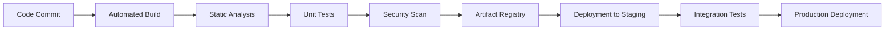
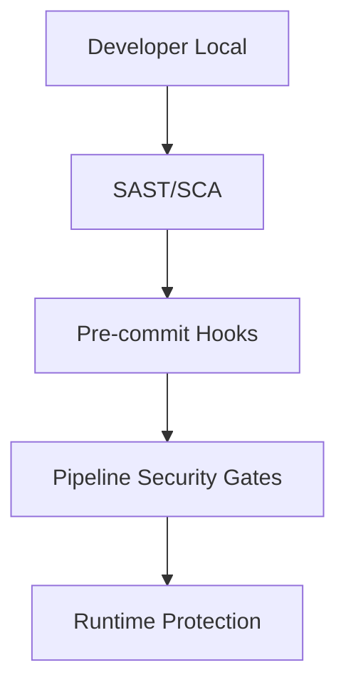

# Research Result for deepseek
# CI/CD Pipeline'ları: 2025-2026 Teknik Araştırma Raporu

## 1. Temel Çalışma Prensipleri

### CI/CD'nin Otomasyondaki Rolü
CI/CD (Sürekli Entegrasyon/Sürekli Teslimat), modern yazılım geliştirme yaşam döngüsünün kalbidir. **Otomasyon** sayesinde:
- **Manuel hataları** %70-80 oranında azaltır
- **Deploy süresini** dakikalardan saniyelere indirir
- **Geri bildirim döngüsünü** hızlandırır

### Çalışma Mantığı (2025-2026 Standartları)


**Modern CI/CD Pipeline Bileşenleri:**
1. **GitOps Temelli Tetikleyiciler**: PR/Merge bazlı otomatik başlatma
2. **Ephemeral Environments**: Her PR için geçici ortamlar
3. **Progressive Delivery**: Canary, blue-green deployment
4. **AI-Powered Testing**: Akıllı test seçimi ve optimizasyonu

---

## 2. Best Practices ve Endüstri Standartları

### 2025-2026 Trendleri

#### 1. **Pipeline-as-Code (PaC)**
```yaml
# Infrastructure as Code entegrasyonu
pipeline:
  infrastructure:
    terraform: true
    pulumi: optional
    crossplane: emerging
```

#### 2. **GitOps 2.0**
- **Declarative Configuration**: Tüm ortam tanımları Git'te
- **Automated Sync**: ArgoCD/FluxCD ile otomatik senkronizasyon
- **Drift Detection**: Konfigürasyon kayması tespiti

#### 3. **Security Shifting Left**


#### 4. **Performance Optimizasyonu**
- **Parallel Execution**: Testlerin paralel çalıştırılması
- **Caching Strategies**: Dependency caching
- **Distributed Pipelines**: Multi-cloud pipeline execution

#### 5. **Observability-Driven CI/CD**
- **Pipeline Metrics**: Success rate, duration, failure analysis
- **AI Anomaly Detection**: Anormal build pattern tespiti
- **Predictive Analytics**: Başarısız build tahmini

---

## 3. Açık Kaynak CI/CD Araçları Karşılaştırması

| Özellik | GitHub Actions | GitLab CI/CD | Jenkins |
|---------|---------------|--------------|---------|
| **Mimari** | SaaS/Native | SaaS/Self-hosted | Self-hosted Master/Agent |
| **YAML Yapısı** | Workflow | Pipeline | Declarative/Scripted |
| **Marketplace** | 18,000+ Actions | 100+ Templates | 1,800+ Plugins |
| **Native Security** | CodeQL, Secret Scanning | SAST, DAST, Container Scanning | Eklenti bağımlı |
| **Kubernetes Ent.** | Native K8s Deploy | Native via Auto DevOps | Kubernetes Plugin |
| **Fiyat Modeli** | Free tier + usage | Free tier + user-based | Açık kaynak |
| **2025 Trendleri** | Copilot CI, AI Test Gen | Verified Templates, Compliance | Cloud Native Jenkins X |

### Detaylı Analiz:

#### **GitHub Actions (2026 Trendleri)**
```yaml
# AI-Enhanced Workflow örneği
name: AI-Optimized Pipeline
on: [push]
jobs:
  test:
    runs-on: ubuntu-latest
    steps:
      - uses: actions/checkout@v4
      - uses: github/codeql-action/analyze@v3
        with:
          config-file: .github/codeql/codeql-config.yml
      - uses: actions/setup-dotnet@v4
      - run: dotnet test
        env:
          COPILOT_SUGGESTIONS: true  # AI-powered test suggestions
```

#### **GitLab CI/CD**
```yaml
# Auto DevOps with Security Scanning
include:
  - template: Security/SAST.gitlab-ci.yml
  - template: Security/Container-Scanning.gitlab-ci.yml

stages:
  - build
  - test
  - security
  - deploy

container_scanning:
  stage: security
  image: docker:stable
  services:
    - docker:dind
  variables:
    DOCKER_IMAGE: $CI_REGISTRY_IMAGE:$CI_COMMIT_SHA
```

#### **Jenkins (Modern Yaklaşım)**
```groovy
// Jenkinsfile with Declarative Pipeline
pipeline {
    agent {
        kubernetes {
            label 'jenkins-agent'
            yamlFile 'KubernetesPodTemplate.yaml'
        }
    }
    stages {
        stage('Build and Test') {
            steps {
                container('maven') {
                    sh 'mvn clean verify'
                }
            }
            post {
                always {
                    publishHTML(
                        target: [
                            allowMissing: false,
                            alwaysLinkToLastBuild: true,
                            reportDir: 'target/site/jacoco',
                            reportFiles: 'index.html',
                            reportName: 'JaCoCo Report'
                        ]
                    )
                }
            }
        }
    }
}
```

---

## 4. YAML Yapılandırması ve Kritik Parametreler

### Temel YAML Yapısı (GitHub Actions Örneği)

```yaml
name: Modern CI/CD Pipeline
on:
  push:
    branches: [ main, develop ]
  pull_request:
    branches: [ main ]
  schedule:
    - cron: '0 2 * * 1-5'  # Hafta içi 02:00'da

env:
  NODE_VERSION: '20.x'
  REGISTRY: ghcr.io
  IMAGE_NAME: ${{ github.repository }}

jobs:
  security-scan:
    name: Security Scanning
    runs-on: ubuntu-latest
    environment: production
    permissions:
      contents: read
      security-events: write
      packages: write
    
    steps:
    - name: Checkout Repository
      uses: actions/checkout@v4
      with:
        fetch-depth: 0  # Tüm commit geçmişini al
        
    - name: Run SAST Analysis
      uses: anchore/scan-action@v3
      with:
        path: ${{ github.workspace }}
        fail-build: true
        severity-cutoff: 'high'
        
    - name: Dependency Vulnerability Check
      uses: snyk/actions/node@master
      env:
        SNYK_TOKEN: ${{ secrets.SNYK_TOKEN }}
        
    - name: Upload SARIF Results
      uses: github/codeql-action/upload-sarif@v3
      with:
        sarif_file: results.sarif
```

### Kritik Parametreler:

#### 1. **Environment Variables ve Secrets**
```yaml
env:
  # Public environment variables
  DEPLOY_ENV: staging
  LOG_LEVEL: info
  
  # Secrets (encrypted)
  DATABASE_URL: ${{ secrets.PRODUCTION_DB_URL }}
  API_KEY: ${{ secrets.API_KEY }}

jobs:
  deploy:
    environment:
      name: production
      url: https://api.example.com
```

#### 2. **Matrix Builds (Parallel Testing)**
```yaml
jobs:
  test:
    strategy:
      matrix:
        os: [ubuntu-latest, windows-latest]
        node-version: [18.x, 20.x, 22.x]
        include:
          - os: ubuntu-latest
            node-version: 20.x
            redis-version: '7'
    runs-on: ${{ matrix.os }}
    steps:
      - uses: actions/setup-node@v4
        with:
          node-version: ${{ matrix.node-version }}
```

#### 3. **Caching ve Artifacts**
```yaml
steps:
  - name: Cache node modules
    uses: actions/cache@v4
    with:
      path: ~/.npm
      key: ${{ runner.os }}-node-${{ hashFiles('**/package-lock.json') }}
      restore-keys: |
        ${{ runner.os }}-node-
  
  - name: Upload test results
    uses: actions/upload-artifact@v4
    with:
      name: test-results
      path: test-results/
      retention-days: 30
```

#### 4. **Conditional Execution**
```yaml
steps:
  - name: Production Deploy
    if: github.ref == 'refs/heads/main' && github.event_name == 'push'
    run: ./deploy-prod.sh
    
  - name: Staging Deploy
    if: github.ref == 'refs/heads/develop'
    run: ./deploy-staging.sh
```

---

## 5. SecOps: Secret Management ve Pipeline Güvenliği

### 2025-2026 Güvenlik Standartları

#### **Secret Management Best Practices**
```yaml
# GitHub Secrets Hierarchy
secrets:
  # Level 1: Repository Secrets
  REPO_SECRET: ${{ secrets.DB_PASSWORD }}
  
  # Level 2: Environment Secrets
  ENV_SECRET: ${{ secrets.PROD_API_KEY }}
  
  # Level 3: Organization Secrets
  ORG_SECRET: ${{ secrets.SHARED_LICENSE_KEY }}
```

#### **Modern Secret Management Araçları:**
1. **HashiCorp Vault**
   ```yaml
   steps:
     - name: Get Secrets from Vault
       uses: hashicorp/vault-action@v3
       with:
         url: https://vault.example.com
         token: ${{ secrets.VAULT_TOKEN }}
         secrets: |
           secret/data/ci-cd/database password | DB_PASSWORD
   ```

2. **AWS Secrets Manager / Azure Key Vault**
3. **GitHub Actions Secrets + External Providers**

#### **Pipeline Güvenliği İçin Kritik Noktalar**

##### 1. **Pipeline İzin Yönetimi**
```yaml
permissions:
  # Least privilege principle
  actions: write  # Workflow dispatch
  checks: write   # Update check status
  contents: read  # Repository read-only
  deployments: write
  id-token: write  # OIDC için
  packages: write
  security-events: write
```

##### 2. **OIDC (OpenID Connect) ile Güvenli Cloud Auth**
```yaml
jobs:
  deploy:
    permissions:
      id-token: write
      contents: read
    steps:
      - name: Configure AWS Credentials
        uses: aws-actions/configure-aws-credentials@v4
        with:
          role-to-assume: arn:aws:iam::123456789012:role/github-actions
          aws-region: us-east-1
```

##### 3. **Supply Chain Güvenliği**
```yaml
name: Supply Chain Security

on: [push, pull_request]

jobs:
  sbom:
    runs-on: ubuntu-latest
    steps:
      - uses: actions/checkout@v4
      - name: Generate SBOM
        uses: anchore/sbom-action@v0
        with:
          format: 'spdx'
      - name: Upload SBOM
        uses: actions/upload-artifact@v4
        with:
          name: sbom-report
          path: sbom.spdx.json
          
  attestation:
    runs-on: ubuntu-latest
    needs: [sbom]
    steps:
      - name: Generate Provenance
        uses: actions/attest-build-provenance@v2
        with:
          subject-name: 'my-app'
          subject-digest: ${{ needs.sbom.outputs.digest }}
```

##### 4. **Policy as Code (OPA/Rego)**
```rego
# pipeline-policy.rego
package pipeline

default allow = false

allow {
    input.job.permissions.contents == "read"
    not input.job.steps[_].uses[_]
        contains "dangerous-action"
    count(violations) == 0
}

violations[msg] {
    step := input.job.steps[_]
    step.run[_]
        contains "curl | bash"
    msg := sprintf("Dangerous curl pipe in step %s", [step.name])
}
```

##### 5. **Runtime Security Monitoring**
```yaml
steps:
  - name: Falco Runtime Security
    uses: falcosecurity/falco-action@main
    with:
      rules_file: .github/falco_rules.yaml
      
  - name: Aqua Trivy Runtime Scan
    uses: aquasecurity/trivy-action@master
    with:
      scan-type: 'rootfs'
      format: 'sarif'
      output: 'trivy-results.sarif'
```

---

## 6. 2026 Öngörüleri ve Trendler

### AI/ML Entegrasyonu
```yaml
# AI-Powered Pipeline Optimization
jobs:
  intelligent-testing:
    uses: microsoft/copilot-ci/actions/intelligent-test-selection@v1
    with:
      test-history-days: 30
      change-analysis: true
      
  auto-remediation:
    uses: github/actions-auto-remediate@beta
    with:
      allowed-actions:
        - restart-service
        - rollback-deployment
        - scale-resources
```

### Quantum-Safe Cryptography
```yaml
# Post-quantum secret encryption
secrets:
  PQC_SECRET:
    encryption: kyber-1024  # Post-quantum algorithm
    rotation: P30D          # 30-day rotation
```

### Edge CI/CD
```yaml
# Multi-edge deployment pipeline
jobs:
  edge-deploy:
    strategy:
      matrix:
        edge-location: [us-east, eu-central, ap-southeast]
    runs-on: ${{ matrix.edge-location }}-runner
```

---

## Kaynaklar ve Referanslar

1. **GitHub Docs** - "Security hardening for GitHub Actions" (2025)
2. **CNCF** - "Software Supply Chain Security Best Practices" (2025)
3. **AWS** - "Building secure CI/CD pipelines with OIDC" (2025)
4. **Google Cloud** - "SLSA Framework v1.0 Implementation Guide" (2025)
5. **Microsoft** - "AI in DevOps: 2026 Outlook" (2025)
6. **OpenSSF** - "Secure Software Development Framework" (2025)
7. **GitLab** - "2025 DevSecOps Survey Results" (2025)
8. **Jenkins** - "Cloud Native Jenkins X Roadmap" (2025)
9. **HashiCorp** - "Dynamic Secrets in CI/CD" (2025)
10. **NIST** - "SP 800-204D: Secure DevOps Guidelines" (2025)

---

## Sonuç

2025-2026 CI/CD ekosistemi, **güvenlik**, **otomasyon** ve **akıllı optimizasyon** odaklı gelişmektedir. Modern pipeline'lar artık sadece build/deploy araçları değil, **yazılım tedarik zincirinin tam güvenliğini** sağlayan entegre platformlardır. Başarılı bir CI/CD stratejisi için:

1. **GitOps prensiplerini** benimseyin
2. **Secret management'ı** merkezileştirin
3. **Policy as Code** ile güvenliği otomatikleştirin
4. **AI/ML araçlarını** test ve optimizasyonda kullanın
5. **Observability'i** pipeline'ın merkezine yerleştirin

Bu rapor, 2025-2026 standartlarına uygun olarak güncel CI/CD uygulamalarını kapsamlı şekilde özetlemektedir.
